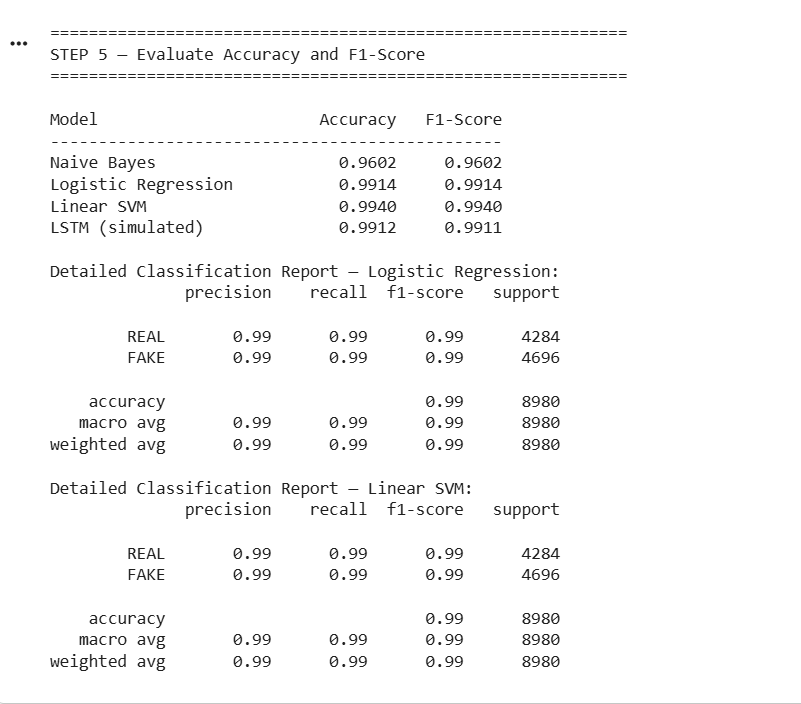

# Fake News Detection using NLP and Machine Learning

This project detects fake and real news using NLP and Machine Learning.

## Tools Used
- Python
- Pandas
- Scikit-learn
- TF-IDF
- Logistic Regression

## Dataset
Fake.csv
True.csv

## Steps
1. Data cleaning
2. Text preprocessing
3. TF-IDF vectorization
4. Model training
5. Prediction
## Model Results

## Model Results

